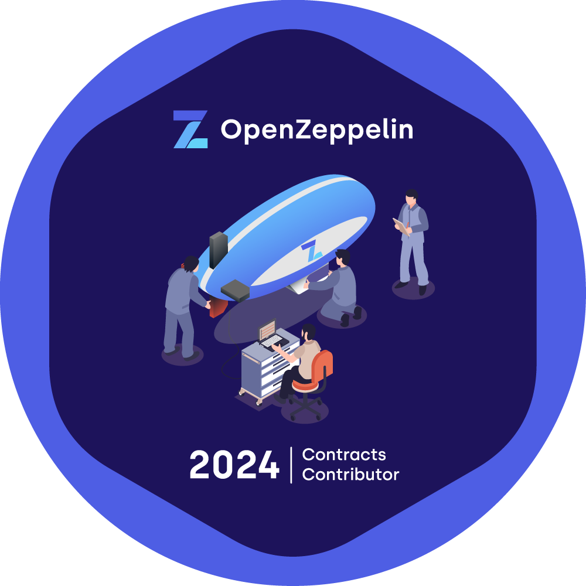

# Hi there 👋

### Senior Software Engineer | Open Source Contributor

With over 10 years of experience in software engineering, I have honed my skills across various technologies and languages. My passion lies in building robust, efficient, and scalable systems.

### 💪 Strongest Tech Stack
- **Rust**
- **Solidity**
- **Elixir**

### 💻 Open Source Contributions
I actively contribute to open source projects, sharing my knowledge and collaborating with the global developer community to push the boundaries of what's possible.

