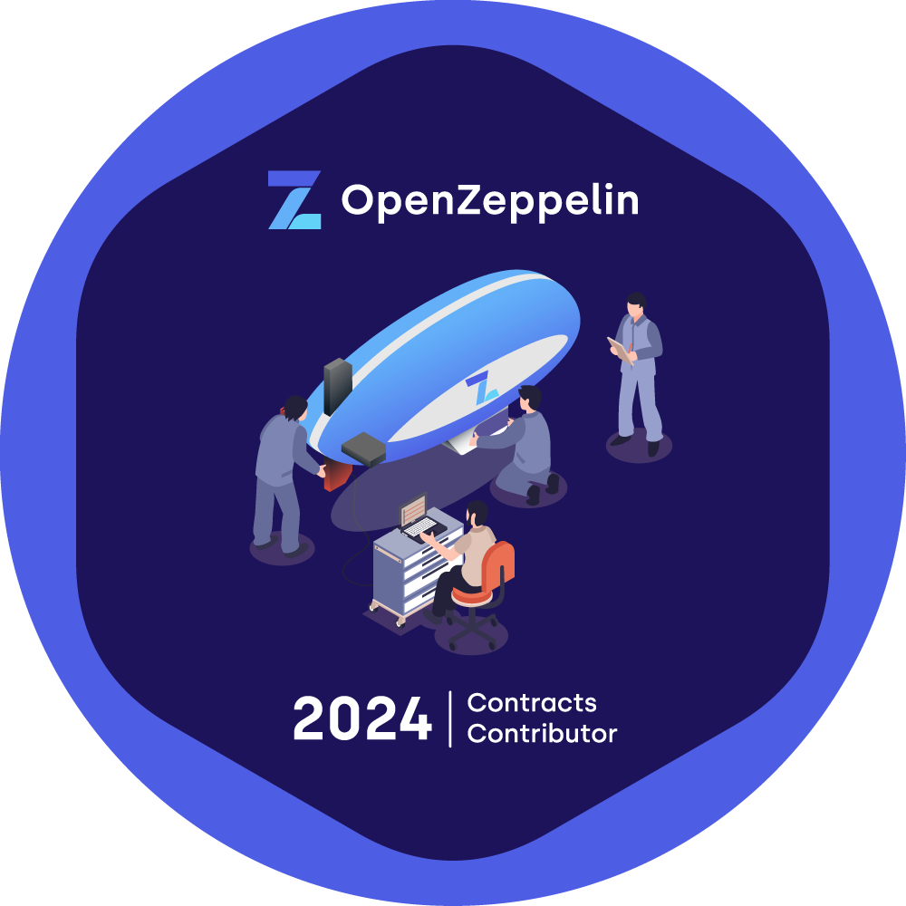

# Hi there 👋

### Senior Software Engineer | Open Source Contributor | Crypto Bot Developer 🤖

With over 10 years of experience in software engineering and blockchain, I specialize in building robust, efficient, and scalable systems—including automated crypto‑trading bots that run 24/7.

### 💪 Strongest Tech Stack
- **Rust**
- **Solidity**
- **Elixir**
- **Python**
- **TypeScript & Node.js**

### 💻 Open Source Contributions
I actively contribute to open source projects, sharing my knowledge and collaborating with the global developer community to push the boundaries of what's possible.

